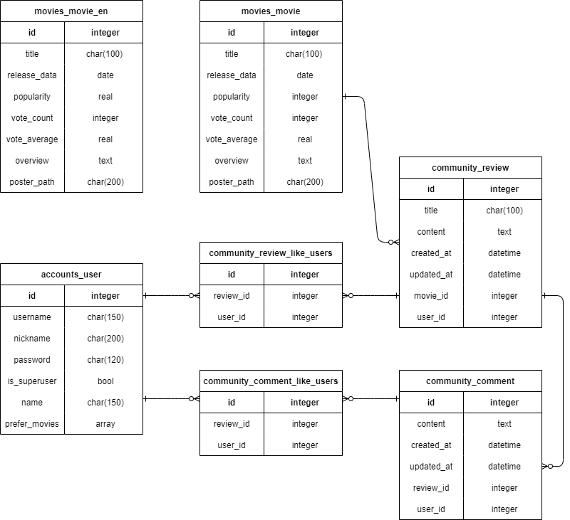

# Welcome to MoJi 👋
##### SSAFY 1학기 최종 프로젝트 - 영화 추천 앱 제작

### 🏠 MoJi

<br>

## ⚙️ 실행 방법

- final-pjt-back에서 필요한 패키지를 설치합니다.

  - ```bash
    $ pip install -r requirements.txt
    ```

- migrate을 실행하고, json파일을 로드합니다.

  - ```bash
    $ python manage.py migrate
    $ python manage.py loaddata data.json
    ```

- Django 프로젝트를 실행합니다.

  - ```bash
    $ python manage.py runserver
    ```

- final-pjt-front에서 필요한 패키지를 설치합니다.

  - ```bash
    $ npm i
    ```

- Vue 프로젝트를 실행합니다

  - ```bash
    $ npm run serve
    ```

<br>

## 👥 팀원 및 업무 분담

**Gil Sang Uk &  Song Eun Ji**

- 길상욱: 백엔드 담당 - DB/ Django REST API 설계, Vue Cli 및 Axios 로직 구현 

- 송은지: 프론트엔드 담당 - 화면 설계 및 디자인, Vue Cli 및 Axios를 통한 REST API 활용

<br>

## 📆 개발 계획

- 진행 기간: 2022.11.15 ~ 2022.11.24


- 목표: 사람들의 선호도에 맞게 영화를 추천하고 영화 마다 사람들의 의견을 들어보자
- 웹사이트 이름: MoJi
  - 영화를 추천하는 사이트로 영화 뭐볼까?라는 생각이 들면 들어오는 사이트로 만들고 싶었습니다.
  - 이를 바탕으로 영화를 영어로한 Movie의 'Mo'와 뭐보지의 'Ji'를 합쳐서 'Moji'가 저희 팀의 이름이 되었습니다.

<br>

## 📒 Tech Log

- <a href="./DailyREADME/README_1116.md">11/16 - 기획 + 개발 세팅 + 메인페이지 + 영화 디테일 페이지 + 리뷰 + 회원가입/로그인 페이지 + 사용자 인증</a>
- <a href="./DailyREADME/README_1117.md">11/17 - DB 수정 + 장르별 영화 랜덤 추천 + 영화, 리뷰 좋아요 + 전체적인 디자인 색상 정하기</a>
- <a href="./DailyREADME/README_1118.md">11/18 - 추천 알고리즘 구현 + 개인 프로필 구현 + NotFound 꾸미기</a>
- <a href="./DailyREADME/README_1119.md">11/19 - 선호하는 영화 검색 후 리스트 담기 + 영화 디테일 Modal + 영화 추천 페이지</a>
- <a href="./DailyREADME/README_1120.md">11/20 - 영화 좋아요 + 영화 리뷰 리스트 + 영화 로고 제작</a>
- <a href="./DailyREADME/README_1121.md">11/21 - 영화 추천 서비스 수정 + 영화 nav바 수정 + 영화 추천 Pagination 적용</a>
- <a href="./DailyREADME/README_1122.md">11/22 - 영화 리뷰 작성 Modal + 리뷰 댓글 작성 Modal + 리뷰 댓글 리스트</a>
- <a href="./DailyREADME/README_1123.md">11/23 - 영화 리뷰 좋아요 + 추천 알고리즘 수정 + 로딩창 수정</a>
- <a href="./DailyREADME/README_1124.md">11/24 - 전반적인 테스트 및 디버깅, 결과 제출을 위한 발표 준비 </a>

<br>

## 🔧 Tech Stack

- **Front-end**
  - Vue CLI
  - Font Awesome
  - Bootstrap
  - Sweet Alert2
  - Vue-Awesome-Swiper
  - Vue-js-modal
  - LittleSnippets
- **Back-end**
  - Django
  - Django-rest-auth
  - Python
  - distilbert-base-uncased
  - huggingface transformer

<br>

## 📌 DB Modeling(ERD)



## 💡 Django


## 💡 Vue

### 1.회원가입 페이지

회원가입은 username, nickname, password 정보를 입력함으로 가능하다.


nickname은 고유값으로 다른 사람이 사용하고 있을 시 같은 값으로는 사용이 불가능하다.

password와 password comfirmation이 다를 경우 또는 사용하고 있는 nickname을 입력시 alert창과 입력값에 빨간색 테두리가 만들어진다.


### 1.1회원가입 후 영화 선택 페이지


회원가입 후 선호하는 영화 정보에 맞추어서 영화를 추천해 주므로, 회원가입 후 바로 로그인이 되고 선택 페이지로 넘어가게 했다.


### 2.로그인 페이지

Login 페이지에서 Signup을 누르면 회원가입 페이지로 이동한다.


### 3.메인 페이지
메인 페이지에는 4가지 종류의 영화를 보여준다


1. 사용자가 좋아요 누르거나 보고싶은 영화로 선택한 영화들을 기반으로 `AI`를 이용해 맞춤 영화를 추천한다.
  - AI를 이용하여 사용자가 고른영화의 **줄거리**를 바탕으로 비슷한 줄거리의 영화를 추천해 준다.
  - AI모델은 BERT를 사용하였고, BERT는 구글에서 개발한 자연어 처리 모델로, 문자열 input을 내부에 학습된 지식을 적용하여 벡터로 치환하여 준다.
  - 이를 이용하여 영화의 줄거리를 보고 장르를 반환해주는 모델을 찾을 수 있었고, 이를 이용하여 추천 알고리즘을 구현하였다.
  - https://huggingface.co/Tejas3/distillbert_110_uncased_movie_genre 

2. 사용자가 좋아요 누른 영화들만 보여준다.


3. 최근개봉 영화를 보여준다.

   


4. 장르를 랜덤으로 선택하여 그 장르에 있는 영화를 랜덤으로 30개 추천해준다. 새로고침을 누를 때마다 장르는 랜덤으로 변경된다.

   


### 3.1 리스트의 Swiper

각 리스트마다 `swiper`를 적용하여 리스트를 넘겨보면서 영화를 고를 수 있게 했다.

첫번째 줄은 영화를 드래그 하면 넘어간다.

두번째 줄부터는 드래그를 하거나 버튼을 누르면 되는데, 이때 버튼을 누르면 반응형을 적용하여 그 페이지에 보이는 영화 개수만큼 넘어간다.

### 3.2 포스터의 hover 

`hover` 기능을 사용하여 이미지에 마우스를 올리면 제목,좋아요 누른 사람수 그리고 평점이 나오고 이미지를 클릭하면 영화 상세 페이지로 넘어간다.

### 4.영화 상세 페이지

 

상세 페이지는 모달을 이용하여 구성하였다.

영화의 예고편이 담긴 youtube 영상을 보여주고, 전체 화면으로 보기도 가능하다.

영화 포스터, 제목, 개봉한 년도, 평점, 영화 줄거리, 감독, 출연진, 좋아요버튼으로 이루어져 있다.

밑에는 리뷰 작성하러 가기 버튼이 있어서 다른 사람들과 리뷰를 공유할 수 있는 커뮤니티가 있다.

리뷰쓰러가기 버튼 밑에는 그 영화와 비슷한 영화들을 추천해준다.


### 4.1 영화 좋아요


하트 버튼을 누르면 버튼이 빨간색 하트로 채워지고 내 좋아요 목록에 추가 된다. 다시 누르면 빈 하트로 바뀌고 내 좋아요 목록에서 삭제 된다.

### 4.2 추천된 비슷한 영화


추천 콘텐츠에  메인 페이지와 똑같은 기능들을 구현했다. bootstrap의 카드를 이용하여 구성하였고, 이미지를 클릭하면 영화 상세 페이지로 넘어간다.


### 5. 리뷰 페이지


그 영화에 달린 다양한 사람들이 작성한 리뷰를 보여준다.

작성자, 제목, 평점, 좋아요 누른 사람수 그리고 그 리뷰에 달린 댓글 수를 보여준다.

작성된 리뷰를 누르면 리뷰의 상세페이지로 이동한다.


### 6. 리뷰 작성 페이지

리뷰 작성을 누르면 `Modal`을 이용하여 리뷰를 작성할 수 있게 한다.

제목, 내용, 평점을 남길 수 있다. 제목과 내용에 입력값이 없으면 리뷰를 등록할 수 없다.

평점은 0부터 10까지 남길 수 있으며 처음에 주어진 값은 10으로 햇다. 리뷰를 통해 남긴 평점은 별을 채워짐으로 리뷰 페이지에서 보여진다.

### 7. 리뷰 상세 페이지


제목, 작성자, 시간, 이 영화에 대한 평점, 리뷰에 대한 좋아요 버튼, 작성된 내용, 댓글 입력창 그리고 달린 댓글들이 표시된다.

### 7.1 리뷰 좋아요


영화 좋아요와 비슷하지만 하트 버튼을 누름과 동시에 버튼 주변에 빨간색 동그라미가 생겼다가 사라지고 하트가 빨갛게 채워진다. 그리고 좋아요 누른 사람수가 1명 증가한다. 다시 누르면 버튼 주변에 흰색 동그라미가 생겼다가 사라지고 하트가 흰색으로 채워진다. 그리고 좋아요 누른 사람수가 1명 줄어든다.


### 7.2 리뷰 수정


수정 버튼을 누르면 입력된 제목과 내용을 기반으로 수정이 가능하다.

다시 제출을 누르면 시간이 작성된 시간에서 수정된 시간으로 변경되어 보여지고, 리뷰 리스트에서는 (수정됨)이라는 표시가 생긴다.

리뷰 수정은 입력한 사용자와 로그인된 사용자가 같을 경우에만 가능하다.

### 7.3 리뷰 삭제

삭제 버튼을 누르면 리뷰가 삭제 되며 그에 따른 댓글들도 삭제된다.

리뷰 삭제는 입력한 사용자와 로그인된 사용자가 같을 경우에만 가능하다.

한번 삭제한 리뷰는 다시 되돌일 수 없다.

### 7.3 댓글 등록


리뷰 상세 페이지에서 리뷰에 따른 댓글이 등록가능하게 했다.

### 7.3.1 댓글 좋아요

리뷰 좋아요와 구성이 똑같게 했다.

### 7.3.1 댓글 수정

리뷰 수정과 같은 원리로, 수정을 누르면 댓글 입력창에 수정하고자 하는 글이 입력되며 다시 등록시 시간 옆에 (수정됨)이 생성된다.

댓글 수정은 입력한 사용자와 로그인된 사용자가 같을 경우에만 가능하다.


### 7.3.2 댓글 삭제 

리뷰 삭제와 같은 원리로, 삭제 버튼을 누르면 댓글 삭제 되며 그에 따른 댓글들도 삭제된다.

댓글 삭제는 입력한 사용자와 로그인된 사용자가 같을 경우에만 가능하다.

한번 삭제한 댓글은 다시 되돌일 수 없다.


### 8. nav바

왼쪽 상단에는 로고를 배치하고, 클릭하면 메인 화면으로 이동되게 하였다. 우측에는 추천받기, 프로필, 로그아웃의 라우터 링크들을 배치하고, 반응형으로 화면이 작아질 경우 드롭다운으로 바뀌게 하였다.


### 8.1 보고 싶은 영화가 없다면?
- 호버 전


- 호버 후


회원 가입시 선택한 영화를 기반으로 추천 받은 영화가 모두 마음에 들지 않을 경우, 알고리즘을 리셋하여 새로운 영화를 기반으로 추천을 진행할 수 있다. 선택 방법 및 추천 알고리즘은 회원가입시 했던 방법과 동일하게 최대 6개 까지 원하는 영화를 선택가능하다.


### 8.2 검색창

검색창을 통해 보고 싶은 영화가 있다면 검색이 가능하다. 검색한 내용이 포함된 모든 영화를 다 보여주며, 가장 인접한 것이 먼저 뜬다. 검색 후 제목을 누르면 `modal`로 영화의 디테일 정보가 뜬다.


### 9. 내 프로필 페이지


프로필 사진과 아이디, 닉네임을 간략하게 표시하며, 프로필사진의 +버튼을 통해 프로필 사진을 교체할 수 있다.

또한 회원 탈퇴를 버튼을 통해 회원에서 탈퇴를 진행할 수 있다.


### 10. 로딩창

이미지를 불러오거나, 추천 영화를 검색할 때 오래 걸리면 로딩창을 띄운다.